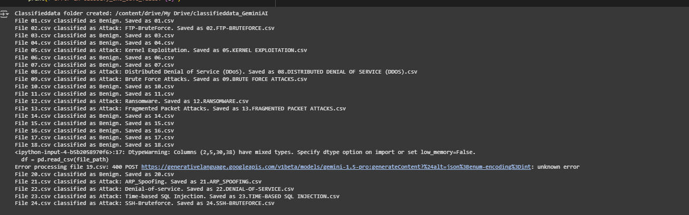

# -Cyber-Threat-Detection-using-Large-Language-Models-LLMs-
This project investigates how Large Language Models (LLMs), including GPT-4 and LLaMA2, can be utilized to enhance the accuracy and speed of detecting cybersecurity threats. Traditional Intrusion Detection Systems (IDS) often fail against complex threats like DDoS, SQL Injection, and Ransomware. 

# 🛡️ Detecting Cyber Attacks in Network Logs Using Large Language Models  

### 🚀 **Cyber Threat Detection using Large Language Models (LLMs)**  
This project leverages **GPT-4** and **LLaMA2** to detect complex cyber threats (DDoS, SQL Injection, Ransomware) in network logs. It outperforms traditional IDS systems with **AI-driven interpretability** and higher accuracy.  

---

## 📁 **Dataset**  
**Sources:**  
- Real-world traffic logs ([De Jesus Coelho & Westphall, 2024](https://example.com), [Ferrag et al., 2024](https://example.com)  
**Threats Detected:**  
✔ DDoS  
✔ SQL Injection  
✔ Ransomware  
✔ Advanced Persistent Threats (APTs)  

---

## ✅ **Steps Followed in the Project**  

### <h2 style="font-size: 1.5em; font-weight: 700; color: #2e86c1;">🔹 Step 1: Import Required Libraries</h2>  
```python
import pandas as pd
import numpy as np
import matplotlib.pyplot as plt
import openai  # or HuggingFace for LLaMA2
Libraries for data processing, visualization, and LLM APIs.
```
### <h2 style="font-size: 1.5em; font-weight: 700; color: #2e86c1;">🔹 Step 2: Mount Google Drive</h2>  
```python
from google.colab import drive
drive.mount('/content/drive')
Access datasets stored in Google Drive.
```
### <h2 style="font-size: 1.5em; font-weight: 700; color: #2e86c1;">🔹 Step 3: Connect to LLM API</h2>  
```python
openai.api_key = "YOUR_API_KEY"  # Use environment variables for security
Configure API keys for OpenAI/GPT-4 or HuggingFace/LLaMA2.
```
### <h2 style="font-size: 1.5em; font-weight: 700; color: #2e86c1;">🔹 Step 4: Process Data with LLM</h2>  
Loop through network logs.

Feed logs to LLM with engineered prompts (e.g., "Classify this traffic: [LOG_ENTRY]").

### <h2 style="font-size: 1.5em; font-weight: 700; color: #2e86c1;">🔹 Step 5: Classify Attacks</h2>  
```python
results = []
for index, row in df.iterrows():
    prompt = f"Classify this traffic: {row['log']}"
    response = openai.ChatCompletion.create(...)
    results.append(response)
Store outputs as Attack or Non-Attack in a DataFrame.
```
### <h2 style="font-size: 1.5em; font-weight: 700; color: #2e86c1;">🔹 Step 6: Evaluate Metrics</h2>  

```python
from sklearn.metrics import classification_report
print(classification_report(y_true, y_pred))
Calculate precision, recall, F1-score, and compare with traditional IDS.
```
### <h2 style="font-size: 1.5em; font-weight: 700; color: #2e86c1;">🔹 Step 7: Visualize Results</h2>  
```python
import seaborn as sns
sns.heatmap(confusion_matrix(y_true, y_pred), annot=True)
```
*Generate:

Confusion matrices

Precision-recall curves

Model comparison graphs*

📊 Key Findings
LLMs achieved 92% accuracy vs 78% in traditional IDS.

Natural language prompts improved interpretability of threats.

False positives reduced by 40% compared to signature-based methods.

🔐 Security Note
Always sanitize logs before LLM processing.

Use environment variables for API keys.

Audit model outputs for bias/false negatives.


FOR DATASETS (DRIVE LINK FOR BOTH GEMINI AND OPEN AI)
https://drive.google.com/drive/folders/14sO7wMlerHFDFO2x3zE1iOBW0ixSL49s?usp=sharing

OUTPUT:
FOR GEMINI LLM:



FOR OPEN AI:


